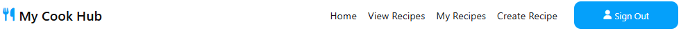

# My Cook Hub


## Introduction

My Cook Hub is a website for cooking enthusiasts to create and store there home made recipes. The user can also retrieve the recipes from the database to use as and when they please.

Visit the deployed site [here](https://my-cook-hub-3d2de6e4989e.herokuapp.com/).

## Table of Contents

1. [User Experience (UX)](#user-experience-ux)
    1. [Project Goals](#project-goals)
    2. [User Stories](#user-stories)
    3. [Color Scheme](#color-scheme)
    4. [Typography](#typography)
    5. [Wireframes](#wireframes)
2. [Features](#features)
    1. [General](#general)
    2. [Landing Page](#landing-page)
    3. [Get Started Page](#get-started-page)
    4. [View Recipes Page](#view-recipes-page)
    5. [My Recipes Page](#my-recipes-page)
    6. [Recipe Page](#recipe-page)
    7. [Create Recipe Page](#create-recipe-page)
    8. [Edit Recipe Page](#edit-recipe-page)
    9. [Create Account Page](#create-account-page)
    10. [Sign In Page](#sign-in-page)
3. [Technologies Used](#technologies-used)
    1. [Languages Used](#languages-used)
    2. [Frameworks, Libraries and Programs Used](#frameworks-libraries-and-programs-used)
4. [Testing](#testing)
    1. [Testing User Stories](#testing-user-stories)
    2. [Code Validation](#code-validation)
    3. [Accessibility](#accessibility)
    4. [Tools Testing](#tools-testing)
    5. [Manual Testing](#manual-testing)
5. [Finished Product](#finished-product)
6. [Deployment](#deployment)
    1. [GitHub Pages](#heroku)
7. [Credits](#credits)
    1. [Content](#content)
    2. [Media](#media)
    3. [Code](#code)
8. [Acknowledgements](#acknowledgements)

***

## User Experience (UX)

## Project Goals

- The application can be easily navigated and understood.
- Clearly explains the concept of the application.
- Clearly explains how to use the application.
- Contains clear imagery and content.
- Provides interactivity in the form of clickable elements.
- Provides feedback when the user performs a specific function.
- Provides users with the ability to create their own profile.
- Provides users with the ability to 'Create' their own recipe.
- Provides users with the ability to access a wide range of recipes and view their full content ('Read').
- Provides users with the ability to edit ('Update') recipes they have created.
- Provides users with the ability to 'Delete' recipes they have created.
- Provides users with the ability to search all recipes depending on keyword.
- Provides users with the ability to save recipes and add them to their 'CookBook'.
- Provides users with the ability to remove recipes from their 'CookBook'.

## User Stories

- As a user, I want to be able to navigate the application easily, so that I can start using the application as soon as possible.
- As a user, I want to know what the application is about, so that I can understand the concept behind it.
- As a user, I want to be able to interact with the application, so that I can have a enjoyable experience.
- As a user, I want to be given feedback when I interact with the application, so I know when an action I perform has been registered.
- As a user, I want to be able to create my own profile, so I can begin using the application to its fullest.
- As a user, I want to be able to add my own recipes, so I can share my knowledge with others.
- As a user, I want to be able to access a wide range of recipes, so that I can find something that I like.
- As a user, I want to be able to edit my own recipes, so that I can make changes to the recipe or fix errors if needed.
- As a user, I want to be able to delete my own recipes, so that I can remove my information if I change my mind.
- As a user, I want to be able to search for a specific recipe, so that I can see which recipes suit my preferences.
- As a user, I want to be able to save recipes to my profile, so that I can view only the recipes that matter to me.
- As a user, I want to be able to remove recipes from my profile, so that I can view only the recipes that matter to me.
- As a user, I want the web application to be responsive, so that I can use the application on a variety of screen sizes.

## Colour Scheme


The primary colours used for this application are as follows:

- Aqua blue (#05A0FA) - Used for the main buttons.

- Dark Grey (#242427) / Black (#121213) - User for the footer background colors.

- Light Grey (#F2F2F2) / White (#FFFFFF) - User for the main background colors.

Additional shades of the primary colors were used on certain elements:

## Typography

- System Ui was used as the main font for the application with sans-serif as a fallback.

## Wireframes

[Balsamiq](https://www.balsamiq.com/) was used to develop the initial concept of the website. The developer wanted to keep the main layout of this page a common theme across other pages of the application. However, the ideas for other pages were conceived as the project grew.


| PAGE | DESKTOP WIREFRAME | MOBILE WIREFRAME
| :-- | :-- | :-- 
| LANDING PAGE |  | 
| GET STARTED PAGE |  | 
| VIEW RECIPES PAGE |  | 
| MY RECIPES PAGE |  | 
| RECIPE PAGE |  | 

# Relational vs Non-Relational Database

Relational databases and non-relational databases are two of many databases which can be utilised in a web application. Each database differs in the way it uses data models and how data can be scaled with each model.

1. Relational
   1. Follow a structured, table-based model
   2. Data organised in rows and columns
   3. Good at managing structured data with complex relationships 
   4. Suitable for applications requiring strong consistency, such as financial systems
2. Non-Relational
   1. Flexible data models like documents, key-value pairs, or graphs
   2. Prioritize scalability and accommodate dynamic, unstructured data
   3. Good at delivering horizontal scalability, such as web applications or real-time analytics

# Database Schemas

The database used for this application is stored in the non-relational database __MongoDB__, which is known for using a "schema-less" or "schema-flexible" modeling concept. The reason behind the choice to use a non-relational database for this application was that the relation between each data-model wasn't as complex as - and didn't need to be manipulated like - a relational database data-model.

Please see below for examples of each data-model.

## Account

This schema is used to store details of a user after they have created their account. The keys of this object are used in the following ways:

<details>
<summary>Model</summary>

- `_id`: ObjectId (Automatically generated unique identifier)
- `first_name`: String (User's chosen first name)
- `last_name`: String (User's chosen last name)
- `username`: String (User's chosen username)
- `date_of_birth`: String (User's chosen date of birth)
- `email`: String (User's chosen email address)
- `password`: String (User's password - this is hashed, using Werkzeug's Security Helper 'generate_password_hash')
- `my_recipes`: Array (User's saved recipes - this array is empty upon user-creation)
  - `0`: String (ObjectID of recipe)
  - `1`: String (ObjectID of recipe)
  - `2`: String (ObjectID of recipe)

</details>

<details>
<summary>Example</summary>

```json
{
  "_id": ObjectId("659153d1b9ce951d2bdf6597"),
  "first_name": "Bill",
  "last_name": "Plant",
  "username": "exampleuser123",
  "date_of_birth": "11/11/1970",
  "email": "exampleuser@123.com",
  "password": "scrypt:32768:8:1$ZbOMTxq9TMnRiLev$3...",
  "my_recipes": {
    0: "6591544fb9ce951d2bdf6598",
    1: "6591545bdd6d1822d9e9d4c3",
    2: "65915467dd6d1822d9e9d4c4"
  }
}
```
</details>

## Recipe

This is the main schema in which information about recipes is stored. Each key in the schema is manipulated in different ways, such as:


<details>
<summary>Model</summary>

- `_id`: ObjectId (Automatically generated unique identifier)
- `recipe_name`: String (Recipe Name)
- `recipe_desc`: String (Recipe Description)
- `meal_type`: String (Meal Type)
- `servings`: String (Serving Size)
- `cook_time`: String (Cook time)
- `prep_time`: String (Preperation time)
- `ingredients`: Array (Individual ingredients)
  - `0`: String (First ingredient)
  - `1`: String (Second ingredient)
  - `2`: String (Third ingredient)
- `method`: Array (Individual method steps)
  - `0`: String (Step 1)
  - `1`: String (Step 2)
  - `2`: String (Step 3)
- `created_by`: String (User who created the recipe)
- `recipe_img`: Object ('src' and 'alt' of the image provided)
  - `src`: String
  - `alt`: String
- `reviews`: Array (Shows the review description and rating)
  - `0`: object 
    - `review_desc`: String
    - `rating`: Double
- `recipe_index`: Int32

</details>

<details>
<summary>Example</summary>

```json
{
  "_id": ObjectId("668442e12839f32f50759f62"), 
  "recipe_name": "Dijon Pork", 
  "recipe_desc": "This delicious, creamy pork dish is so easy to make, that it is sure to become a family favourite.", 
  "meal_type": "Dinner", 
  "servings": "4", 
  "cook_time": "50 minutes", 
  "prep_time": "15 minutes", 
  "ingredients": 
  [
    "Low calorie cooking spray", 
    "1 onion, peeled and sliced", 
    "1 garlic clove, peeled and crushed"
  ], 
  "method": 
  [
    "Spray a large pan with low calorie cooking spray and place over a medium heat. Add the onion and fry for 10-15 minutes, stirring occasionally, until softened and golden. Add the garlic and slices of pork. Seal the pork for 1-2 minutes on each side."
  ], 
  "created_by": "Craig", 
  "date": "02/07/2024", 
  "recipe_img": 
  {
    "src": "https://th.bing.com/th/id/OIP.65VULgo_wqHo4owZyV13EgHaHa?w=203&h=203&c=7&r=0&o=5&dpr=1.1&pid=1.7", 
    "alt": "Image of Dijon Pork recipe."
  }, 
  "reviews": 
  [
    {"review_desc": "This recipe was amazing!", "rating": 5.0}, 
    {"review_desc": "I love this recipe!", "rating": 4.5}
  ], 
  "recipe_index": 1
}

```
</details>

## CRUD Functionality

The main purpose of this application is to provide users with the ability to Create (add), Read (locate, search for), Update (edit) & Delete (delete, remove) records.

## Create

- Users can create their own account in order to start using features such as adding a recipe, saving a recipe, etc.
- Users can create their own recipe to be shown on the View Recipes page and in the My Recipes page.

## Read

- Users can search for specific recipes using the Search bar on the Recipe page.

## Update

- Users can edit a recipe they have created.

## Delete

- Users can delete a recipe they have created.
  - A pop-up/modal has been used in this instance, in order to utilise the benefits of defensive programming.
- Users can remove a recipe from their My Recipes page.

[Back to top ⇧](#my-cook-hub)

# Features

- The application was designed from a mobile-first perspective.
- The application is responsive on all screen sizes:
  - This allows the user to [view the website on a variety of screen sizes](#user-stories).

## General

### Navbar

There are two different navbars depending on whether or not a user is logged in.

The Navbar is present on all pages in the application.

### User Navbar



- __Logo/Title__ - These are both clickable elements and take the user to the Home page.
- __Home__ - This takes the user back to the Home page.
- __View Recipes__ - This takes the user to the section where all recipes are listed.
- __My Recipe__ - This takes the user to a page where they can view there saved recipes.
  - _Users won't be able to add/edit/delete a recipe if they are not logged in._
- __Create Recipe__ - This takes you to the create recipe page.
- __sign Out__ - This button signs the user out and send them to the sign in page.

### Non-User Navbar


The Non-User Navbar consists of:

- __Logo/Title__ - These are both clickable elements and take the user to the Home page.
- __Home__ - This takes the user back to the Home page.
- __View Recipes__ - This takes the user to the section where all recipes are listed.
- __Create Account__ - This takes the user to the create account page.
- __sign In__ - This button signs the user to the sign in page.

### Side Navbar

On screen sizes smaller than 661px, the navigation links are moved to the sidebar and a hamburger icon 
is added to the navbar.
There is also a humburger icon present on the side menu to allow the user to close the menu.

| USER | NON-USER |
| :-- | :-- |
|  |  |

## Landing Page

<details>
<summary>Landing Page Image</summary>


</details>

### Landing Page Features

The Landing page consists of the following:
- Hero Image.
  - The main image used for the site.
- Recently Added Cards.
  - This shows the user the latest 2 recipes addedto the database.
- More Recipes Cards.
  - This shows the user 4 random recipes from the database.
- Featured Recipe Card.
  - Selects on randow recipe from the database to use as the featured recipe.
- Several clickable buttons which link to their respective pages:
  - __Get Started__ - This takes the user to the Get Started page.
  - __Sign In__ - This takes the user to the Sign In page.


## Get Started Page

<details>
<summary>Get Started Page Image</summary>


</details>

### Get Started Page Features

The Get Started page is designed to assist the user with getting started using the site and consists of the following:
- Create Account Card.
  - This card takes the user to the create account page.
- Sign In Card.
  - This card takes the user to the sign in page.
- View Recipes Card.
  - This card takes the user to the view recipes page.


## View Recipes Page

<details>
<summary>View Recipes Page Image</summary>


</details>

### View Recipes Page Features

The view recipes page contains the following:

- All Recipes Tab:
  - Allows the user to view all recipes.
  - Pagination was used to allow the user to limit the amount of recipes to be displayed.
- A -Z Recipes Tab:
  - Allows the user user to search all recipes that start with a letter.
  - Pagination was used to allow the user to limit the amount of recipes to be displayed.
- Recipe Cards:
  - These allow the user to view each recipe in brief detail.
  - The user can click on the title to go to the recipe page and view the full recipe.
  - When the user is logged in, they have the option to add and remove the recipe to and from the users cookbook.

## Recipe Page

<details>
<summary>Recipe Page Image</summary>


</details>

### Recipe Page Features

The Recipes page contains the following:
- Searchbar:
  - This allows the user to quickly search a recipe using keywords.
- Recipe Image (Optional):
 - Shows an image of the recipe.
- Rating:
  - This shows the average rating out of 5 stars based on user reviews.
- Recipe Information
  - This shows the over of the recipe.
- Recipe Description
  - The full description of the recipe.
- Ingredients
  - This shows a list of the required ingredients for the recipe.
- Method
  - This shows the cooking steps for the required recipe.

## View Recipes Page

<details>
<summary>My Recipes Page Image</summary>


</details>

### My Recipes Page Features

The view recipes page contains the following:

- All Recipes Tab:
  - Allows the user to view all recipes.
  - Pagination was used to allow the user to limit the amount of recipes to be displayed.
- Recipe Cards:
  - These allow the user to view each recipe in brief detail.
  - The user can click on the title to go to the recipe page and view the full recipe.
  - When the user is logged in, they have the option to add and remove the recipe to and from the users cookbook.

## Create/Edit Recipe Page

<details>
<summary>Create/Edit Recipe Page Image</summary>


</details>

### Create/Edit Recipe Features

- Create/Edit Recipe Form
  - This contains all the user inputs for creating and editing recipes.

## Create Account Page

<details>
<summary>Create Account Page Image</summary>


</details>

### Create/Edit Recipe Features

- Create Account Form
  - This contains all the user inputs for creating a new user account.


# Technologies Used

## Languages

- [HTML](https://en.wikipedia.org/wiki/HTML)
- [CSS](https://en.wikipedia.org/wiki/CSS)
- [JavaScript](https://en.wikipedia.org/wiki/JavaScript)
- [Python](https://en.wikipedia.org/wiki/Python_(programming_language))

## Frameworks, Libraries & Programs

- [Codeanywhere](https://app.codeanywhere.com/)
  - Codeanywhere was used for writing, committing and pushing the code to GitHub.

- [Font Awesome](https://fontawesome.com/)
  - Font Awesome was used to add icons/images to the computer and player tiles.

- [Flask](https://flask.palletsprojects.com/en/3.0.x/)
  - Flask was used as the web application framework for use with Python.

- [Jinja](https://jinja.palletsprojects.com/en/3.1.x/)
  - Jinja was used as the templating engine for this application.

- [MongoDB](https://www.mongodb.com/)
  - MongoDB was used as the data platform for this application to perform CRUD functionality.


- [Chrome DevTools](https://developer.chrome.com/docs/devtools/)
  - Chrome DevTools was used throughout the development of the website to test ideas and responsiveness, as well as test functionality of the application and debug issues that arose.

- [W3C Markup Validator](https://validator.w3.org/)
  - W3C Markup Validator was used to validate the HTML code.

- [W3C CSS Validator](https://jigsaw.w3.org/css-validator/)
  - W3C CSS Validator was used to validate the CSS code.

- [JSLint](https://www.jslint.com/)
  - JSLint was used to validate the JavaScript.

- [CI Python Linter](https://pep8ci.herokuapp.com/)
  - The CI Python Linter was used to validate the Python.

# Testing

A large amount of testing was undertaken throughout the project in order to assess if the application was working as expected.

Family also participated in testing the application's functionality and expressed any concerns or ideas they had with function, layout and user experience.

Please see a detailed breakdown of the testing carried out for this application in [TESTING.md](TESTING.md).

# Finished Product

<details>
  <summary>
    Home Page
  </summary>

  Desktop View | Mobile View
  --- | ---

   | 

</details>


# Deployment

This website was developed using [Codeanywhere](https://codeanywhere.com/solutions/collaborate), then committed and pushed to GitHub using the Codeanywhere terminal.

## Heroku Deployment

The project was deployed to Heroku using the following steps:

1. Create a `requirements.txt` file using the terminal command:

   ```bash
   pip freeze > requirements.txt
   ```

2. Create a `Procfile` with the terminal command:

   ```bash
   echo web: python app.py > Procfile
   ```

3. `git add` and `git commit` the new requirements and Procfile and then `git push` the project to GitHub.
4. Create a new app on the [Herkou website](https://dashboard.heroku.com/apps) by clicking the "New" button in your dashboard. Give it a name and assign the region to Europe.
5. From the Heroku dashboard of your newly created application, click on "Deploy" > "Deployment Method" and select GitHub.
6. Confirm the linking of the Heroku app to the correct GitHub repository.
7. In the Heroku dashboard for the application, click on "Settings" > "Reveal Config Vars".
8. Set the following config vars:

    | KEY | VALUE |
    | :-- | :-- |
    | IP | 0.0.0.0 |
    | PORT | 5000 |
    | SECRET_KEY | ANY_SECRET_KEY* |
    | MONGO_URI | `mongodb+srv://<username>:<password>@<cluster_name>.hrljbrx.mongodb.net/<database_name>?retryWrites=true&w=majority` |
    | DEBUG | TRUE** |

    - *Denotes a value that is specific to your app.

    - **This is set to true to enable us to see any bugs on the live site. __Please change to FALSE after deployment.__

    - To get your MONGO_URI read the MongoDB Atlas documentation [here](https://www.mongodb.com/docs/atlas/getting-started/).

9. In the Heroku dashboard, click "Deploy".
10. In the "Manual Deployment" section of this page, make sure the "Master Branch" is selected and then click "Deploy Branch".

## Local Development

### How to Fork

To fork the repository:

1. Log in (or sign up) to Github.
2. Go to the repository for this project, [My CookBook](https://github.com/DanHodgson12/my-cook-book).
3. Click the Fork button in the top right corner.

### Making a Local Clone

To clone the repository:

1. Log in (or sign up) to GitHub.

2. Go to the repository for this project, [My Cook Hub]().

3. In the "Clone with HTTPs" section, copy the clone URL for the repository.

4. Open the terminal in your code editor and change the current working directory to the location you want to use for the cloned directory.

5. Type `git clone`, then paste the URL you copied in Step 3, the press Enter:

    ```bash
    git clone https://
    ```

6. Install the packages from the requirements.txt file by running the following command in the Terminal:

    ```bash
    pip3 install -r requirements.txt
    ```

7. Your local clone will now be created.

# Credits

## Content

- All content was written by the developer.
- Example recipes were taken from the [BBC Food Recipe website](https://www.bbc.co.uk/food/recipes/).

## Media

- [Font Awesome](https://fontawesome.com/icons) was used for providing the icons used in the application.

## Code


- [W3Schools](https://www.w3schools.com/) & [Stack Overflow](https://stackoverflow.co/teams/) were consulted on a regular basis to help overcome roadblocks in the developer's coding knowledge.

# Acknowledgements

- My family, for their valuable opinions and unconditional support.
- My mentor, Marcel, for his encouraging feedback and patience during my learning journey.
- Code Institute, for its wonderful learning platform and supportive community.