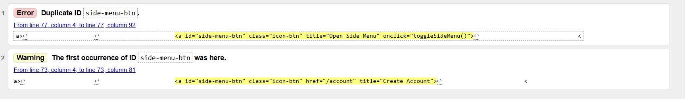
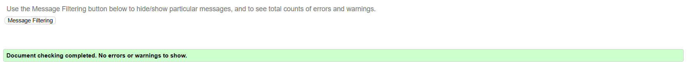
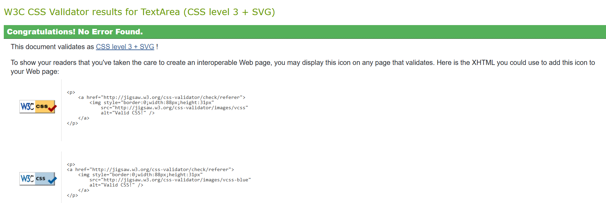
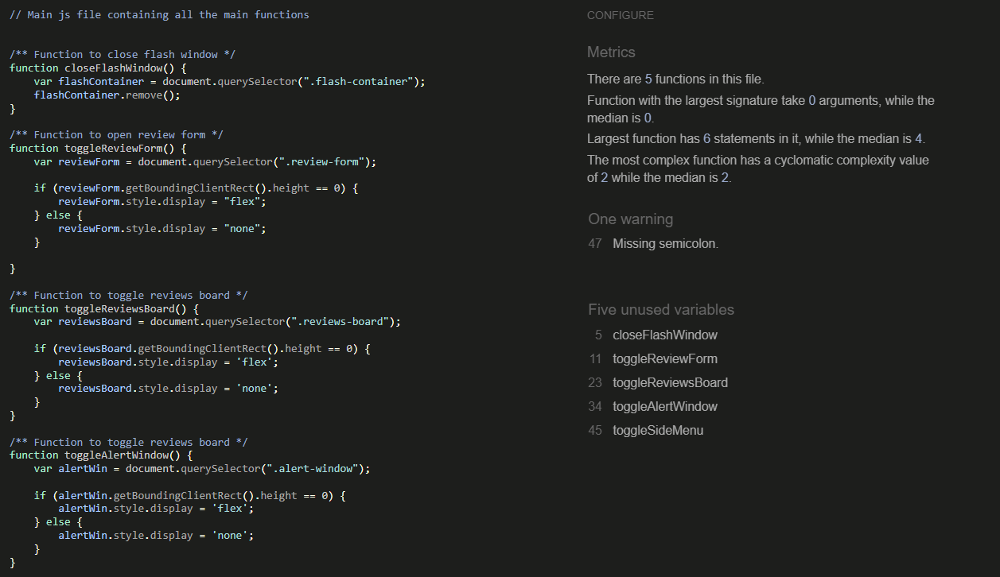

# Testing

## Testing Paradigms

There are two types of testing a developer can carry out before, during and after writing a web application - Automated and Manual.

### Automated Testing

1. __Quicker__: Automated testing allows for hundreds of tests to be run in a short space of time, making it more resourceful than Manual testing.
2. __Efficient__: Tests written by developers help to detect errors earlier on, and help avoid writing code that likely won't perform as expected.
3. __Specific__: Tests can be written for specific edge cases in which manual testing may not be able to pick up.
4. __Resourceful__: Automated tests can be used for continuous testing of an application, making it easier to find an error if a new piece of content is added to a page, for example.
5. __Data-driven__: Automated testing can be used to check if a piece of code provides the same outcome when using different sources of data.

### Manual Testing

1. __UX(User Experience)__: Manual testing allows for the developer to check if the user experience of the application is as intended.
2. __Layout/Responsiveness__: Manual testing allows for the developer to inspect the application on different browsers and devices, which is something automated testing would not pick up on.
3. __Animation & Interactivity__: Manual testing allows for the developer to check if animations and interactions between elements are performing as expected.
4. __Accessibility__: Manual testing allows the developer to test the application with screen readers and make sure it is accessible.

Although one form of testing may be more appropriate than the other for a specific application, they do both have downsides. The disadvantage of one form of testing is usually something the other form of testing can provide.

Due to this, it is best practice to utilise both forms of testing during the building of an application. However, the choice for which form of testing to use depends on resources available, budget and whether or not you have a team large enough to carry out the tests.

The developer chose to use manual testing as the main form of testing throughout this project. They felt it was an efficient method for this type of application due to its size and the fact that a lot of visual changes of the application relied on functions rendering data.

## Testing User Stories

- __As__ a user, I want to be able to navigate the application easily, __so__ that I can start using the application as soon as possible.
  - __Given__ I load the web application, __when__ I look at the home page, __then__ I will be able to see the instructions for navigating the website easily.

- __As__ a user, I want to know what the application is about, __so__ that I can understand the concept behind it.
  - __Given__ I load the web application, __when__ I look at the home page, __then__ I will be able to see information explaining the purpose for the web application.

## Tools Testing

- [Google Chrome DevTools](https://developer.chrome.com/docs/devtools/)
  - Google Chrome DevTools was used throughout the development process to test, explore and make changes to the HTML and CSS of the webpage.

- Responsiveness
  - [Responsive Design Checker](https://www.responsivedesignchecker.com/) was used to check responsiveness across a variety of devices and screen sizes.
  - [Am I Responsive?](https://ui.dev/amiresponsive) was used to check responsiveness across different screen sizes and generate the mockup final image.
  - [Google Chrome DevTools](https://developer.chrome.com/docs/devtools/) was used to check responsiveness across different screen sizes during the development and testing phases.

## Compatibility Testing

### Browser Compatibility

Browser | Outcome | Pass/Fail
--- | --- | ---
Google Chrome | No appearance, responsiveness or functionality issues | Pass
Safari | No appearance, responsiveness or functionality issues | Pass
Mozilla Firefox | No appearance, responsiveness or functionality issues | Pass
Microsoft Edge | No appearance, responsiveness or functionality issues | Pass
  
### Device Compatibility

The web application was tested across a wide variety of devices using [Google Chrome DevTools](https://developer.chrome.com/docs/devtools/) & [Responsive Design Checker](https://www.responsivedesignchecker.com/).

- No appearance, responsiveness or functionality issues were found.

## Common Elements Testing

### Navbar

#### Logo/Header Functionality

Outcome | Pass/Fail
--- | ---
Logo and header both reload the home page when clicked, as expected | Pass

#### Nav Links Displayed

Status | Links Displayed | Pass/Fail
--- | --- | ---

#### Nav Links Functionality

Link | Outcome | Pass/Fail
--- | --- | ---

#### Side Nav

Outcome | Pass/Fail
--- | ---

---

### Home

Outcome | Pass/Fail
--- | ---

---

### View Recipes

Outcome | Pass/Fail
--- | ---

### Fixed Bugs

## Code Validation

The [W3C Markup Validator](https://validator.w3.org/) and [W3C CSS Validator](https://jigsaw.w3.org/css-validator/) services were used to check for any code errors or misuse of syntax/elements in the HTML & CSS.

The [JSHint](https://jshint.com/) service was used to check for any code errors or misuse of syntax in the JavaScript.

The [CI Python Linter](https://pep8ci.herokuapp.com/) service was used to check for any linting errors in the Python code.

### HTML

The W3C Markup Validator returned multiple errors and warnings with a lot of the Jinja templating language used. The developer chose to ignore these specific warnings, as this tool is primarily designed to validate static HTML and doesn't recognize server-side templating languages, including Jinja.

Other than the above, there were a few legitimate errors/warnings with the HTML on the following pages:

#### home.html

- The validator showed a duplicate id. This was removed to clear the error.

#### get_started.html

- No errors where found when validating this page.

#### view_recipes.html

- No errors where found when validating this page.

#### home.html

- 

#### home.html

- 

#### home.html

- 

#### home.html

- 

#### home.html

- 

### CSS

The W3C CSS Validator returned no errors.

### JavaScript

The JSHint Validation returned a few errors in the code for undefined variables:

- One missing semi-colon warning was raised which was corrected.
- The 5 un-used variables were ignored as these are function names which were called using the onclick method in the HTML files.

### Python

The CI Python Linter returned a few small errors on each file. These have now been resolved.

## Lighthouse Report

Lighthouse in Google Chrome Dev Tools was used to test performance, accessibility, best practices and search engine optimisation of the webpage.

Suggestions were made to optimise SEO by adding 'meta' tags to each page. However, this was ignored as meta tags were included in the base template and were being duplicated via Jinja.

Page | Report | Comments
--- | --- | ---
LANDING PAGE : |  | Best practices was lower than expected due to the image from pexels being used in the hero section.
GET STARTED PAGE : |  | No Issues
VIEW RECIPES PAGE : |  | No Issues
AZ RECIPES PAGE : |  | No Issues
MY RECIPES PAGE : |  | No Issues
RECIPE PAGE : |  | No Issues
CREATE RECIPE PAGE : |  | No Issues
EDIT RECIPE PAGE : |  | No Issues