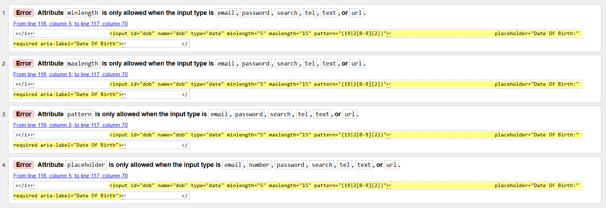

# Testing

## Testing Paradigms

There are two types of testing a developer can carry out before, during and after writing a web application - Automated and Manual.

### Automated Testing

1. __Quicker__: Automated testing allows for hundreds of tests to be run in a short space of time, making it more resourceful than Manual testing.
2. __Efficient__: Tests written by developers help to detect errors earlier on, and help avoid writing code that likely won't perform as expected.
3. __Specific__: Tests can be written for specific edge cases in which manual testing may not be able to pick up.
4. __Resourceful__: Automated tests can be used for continuous testing of an application, making it easier to find an error if a new piece of content is added to a page, for example.
5. __Data-driven__: Automated testing can be used to check if a piece of code provides the same outcome when using different sources of data.

### Manual Testing

1. __UX(User Experience)__: Manual testing allows for the developer to check if the user experience of the application is as intended.
2. __Layout/Responsiveness__: Manual testing allows for the developer to inspect the application on different browsers and devices, which is something automated testing would not pick up on.
3. __Animation & Interactivity__: Manual testing allows for the developer to check if animations and interactions between elements are performing as expected.
4. __Accessibility__: Manual testing allows the developer to test the application with screen readers and make sure it is accessible.

Although one form of testing may be more appropriate than the other for a specific application, they do both have downsides. The disadvantage of one form of testing is usually something the other form of testing can provide.

Due to this, it is best practice to utilise both forms of testing during the building of an application. However, the choice for which form of testing to use depends on resources available, budget and whether or not you have a team large enough to carry out the tests.

The developer chose to use manual testing as the main form of testing throughout this project. They felt it was an efficient method for this type of application due to its size and the fact that a lot of visual changes of the application relied on functions rendering data.

## Testing User Stories

- __As__ a user, I want to be able to navigate the application easily, __so__ that I can start using the application as soon as possible.
  - __Given__ I load the web application, __when__ I look at the home page, __then__ I will be able to see the instructions for navigating the website easily.

- __As__ a user, I want to know what the application is about, __so__ that I can understand the concept behind it.
  - __Given__ I load the web application, __when__ I look at the home page, __then__ I will be able to see information explaining the purpose for the web application.

## Tools Testing

- [Google Chrome DevTools](https://developer.chrome.com/docs/devtools/)
  - Google Chrome DevTools was used throughout the development process to test, explore and make changes to the HTML and CSS of the webpage.

- Responsiveness
  - [Responsive Design Checker](https://www.responsivedesignchecker.com/) was used to check responsiveness across a variety of devices and screen sizes.
  - [Am I Responsive?](https://ui.dev/amiresponsive) was used to check responsiveness across different screen sizes and generate the mockup final image.
  - [Google Chrome DevTools](https://developer.chrome.com/docs/devtools/) was used to check responsiveness across different screen sizes during the development and testing phases.

## Compatibility Testing

### Browser Compatibility

Browser | Outcome | Pass/Fail
--- | --- | ---
Google Chrome | No appearance, responsiveness or functionality issues | Pass
Safari | No appearance, responsiveness or functionality issues | Pass
Mozilla Firefox | No appearance, responsiveness or functionality issues | Pass
Microsoft Edge | No appearance, responsiveness or functionality issues | Pass
  
### Device Compatibility

The web application was tested across a wide variety of devices using [Google Chrome DevTools](https://developer.chrome.com/docs/devtools/) & [Responsive Design Checker](https://www.responsivedesignchecker.com/).

- No appearance, responsiveness or functionality issues were found.

## Common Elements Testing

### Navbar

#### Logo/Header Functionality

Outcome | Pass/Fail
--- | ---
Logo and header both reload the home page when clicked, as expected | Pass
Nav links are hidden on smaller | Pass
Nav buttons are hidden on smaller screens and replaced with icon buttons | Pass
All links shown correctly depending on User or Non-User | Pass

#### Nav Links Displayed

Status | Links Displayed | Pass/Fail
--- | --- | ---
SignIn/Out button | Signs the user in and changes text to sign user out | Pass
Create Account button | Directs the user to the create account page | Pass

#### Nav Links Functionality

Link | Outcome | Pass/Fail
--- | --- | ---
Home | Redirects to the home page | Pass
View Recipes | Redirects the user to the voew recipes page | Pass
My Recipes | Displayed as hidden when not signed in and redirects to my recipes page when signed in | Pass
Create Recipe | Displayed as hidden when not signed in and redirects to my create recipe page when signed in | Pass

#### Side Navbar

Outcome | Pass/Fail
--- | ---
Navbar collapses to side nav on smaller screens | Pass
Navbar expands on screens larger larger screens | Pass
Burger Icon opens and closes sidenav as expected | Pass
All links work as expected | Pass

### Footer

Outcome | Pass/Fail
--- | ---
All links redirect the user to the correct page | Pass
All social media links open in a new tab and link to the site described | Pass

### Home

Outcome | Pass/Fail
--- | ---
Text displayed clearly with no formatting issues | Pass
Sign In/Out button takes user to Sign In page as expected And Signs the user out as expected once signed in | Pass
Create Account button takes user to Create Account page as expected | Pass
Get Started button takes user to Get Started page as expected | Pass

### Get Started Page

Outcome | Pass/Fail
--- | ---
__Create Account__ button Redirects the user to the create account page | Pass
__Sign In__ button redirects user to the sign in page | Pass
__View Recipes__ button directs the user to the view recipes page | Pass

### Sign In Page

Outcome | Pass/Fail
--- | ---
A flash error message for validation displays if no text entered in Username or Password field | Pass
Submitting the form successfully checks if the username and password belong to the same user | Pass
Submitting the form with correct information signs the user in and takes them to the home page | Pass
Submitting the form with correct information displays the appropriate flash message at the top of the screen | Pass
Submitting the form with incorrect information prevents user from signing in | Pass
Submitting the form with incorrect information displays a error flash message at the top of the screen | Pass
Error flash message indicates either Username or Password incorrect | Pass

### Create Account Page

Outcome | Pass/Fail
--- | ---
A flash error message for validation displays if no text entered in Username or Password field | Pass
Submitting the form successfully checks if the username belongs to the same user | Pass
Submitting the form with correct information adds a new account to the database and takes them to the home page | Pass
Submitting the form with correct information displayes the correct flash message | Pass
Register functionality successfully hashes the user's password and displays as encrypted in the database | Pass
Already have an account link takes user to sign in page as expected | Pass

### View Recipes Page

Outcome | Pass/Fail
--- | ---
Text displayed clearly with no formatting issues | Pass
Tab buttons take user to correct page | Pass
Recipe cards display the correct image and information | Pass
Recipe Cards link take the user to the full recipe page | Pass
Add/Remove recipe button is hidden on cards when user is signed out | Pass
When present, the Add/Remove button successfully adds or removes the card to and from users My Recipes page | Pass
When adding or removing recipes, the correct flash message is displayed to notify user of the action taken | Pass
Pagination works as expected displaying the correct amount of records selected by the user | Pass
Changing the records to be displayed dropdown updated the page with the changes | Pass

### AZ Recipes Page

Outcome | Pass/Fail
--- | ---
Text displayed clearly with no formatting issues | Pass
Tab buttons take user to correct page | Pass
Pressing a letter button displays only recipes that start with that letter | Pass
Recipe cards display the correct image and information | Pass
Recipe Cards link take the user to the full recipe page | Pass
Add/Remove recipe button is hidden on cards when user is signed out | Pass
When present, the Add/Remove button successfully adds or removes the card to and from users My Recipes page | Pass
When adding or removing recipes, the correct flash message is displayed to notify user of the action taken | Pass
Pagination works as expected displaying the correct amount of records selected by the user | Pass
Changing the records to be displayed dropdown updated the page with the changes | Pass

### My Recipes Page

Outcome | Pass/Fail
--- | ---
Text displayed clearly with no formatting issues | Pass
Tab buttons take user to correct page | Pass
Recipe cards display the correct image and information | Pass
Recipe Cards link take the user to the full recipe page | Pass
Add/Remove recipe button is hidden on cards when user is signed out | Pass
When present, the Add/Remove button successfully adds or removes the card to and from users My Recipes page | Pass
When adding or removing recipes, the correct flash message is displayed to notify user of the action taken | Pass
Pagination works as expected displaying the correct amount of records selected by the user | Pass
Changing the records to be displayed dropdown updated the page with the changes | Pass

### Recipe Page

Outcome | Pass/Fail
--- | ---
Text displayed clearly with no formatting issues | Pass
Images displayed correctly with no issues | Pass
All recipe information is displayed correctly on the page | Pass
Average rating correctly displayed | Pass
Related recipes displaye correctly | Pass
Clicking on link of related recipes displays that recipe | Pass
Clicking on the reviews link opens up the reviews popup | Pass

### Add review

Outcome | Pass/Fail
--- | ---
Clicking the button opens up the add review form | Pass
Submitting the form adds the review to the database | Pass
Submitting the form with correct information displays the appropriate flash message at the top of the screen | Pass
Submitting the form with incorrect information prevents user from submitting review | Pass
The button displays the correct title text | Pass

### Delete Recipe

Outcome | Pass/Fail
--- | ---
Clicking the button displays the warning popup | Pass
Selecting yes in the popup deletes the recipe from the database | Pass
Delete recipe button is only visible on recipes created by the signed in user | Pass
The button displays the correct title text | Pass

### Edit Recipe

Outcome | Pass/Fail
--- | ---
The edit recipe button is only visible on recipes created by the signed in user | Pass
Pressing the edit button redirects the user to the edit recipe page | Pass
The button displays the correct title text | Pass

#### Search Bar

Outcome | Pass/Fail
--- | ---
Successfully renders recipes related to keyword or keywords | Pass
__Cancel__ button clears search bar as expected | Pass
__Search__ button executes search function as expected | Pass

### Create Recipe Page

Outcome | Pass/Fail
--- | ---
form does not submit unless all the required fields are filled in | Pass
Submitting the form displays the relevent flash message | Pass
Submitting the form adds the recipe to the database | Pass

### Edit Recipe Page

Outcome | Pass/Fail
--- | ---
The form displays the correct recipe information in the fields | Pass
Submitting the form updated the recipe in the database | Pass
Submitting the form displays the relevent flash message | Pass

### Fixed Bugs

- Fixed bug with side menu not staying in fixed position

### Known Bugs

There is one minor issue i was unable to resolve when editing the recipe.
You have to re-select the meal type from the select element.
All other fields display the correct information.

## Code Validation

The [W3C Markup Validator](https://validator.w3.org/) and [W3C CSS Validator](https://jigsaw.w3.org/css-validator/) services were used to check for any code errors or misuse of syntax/elements in the HTML & CSS.

The [JSHint](https://jshint.com/) service was used to check for any code errors or misuse of syntax in the JavaScript.

The [CI Python Linter](https://pep8ci.herokuapp.com/) service was used to check for any linting errors in the Python code.

### HTML

The W3C Markup Validator returned multiple errors and warnings with a lot of the Jinja templating language used. The developer chose to ignore these specific warnings, as this tool is primarily designed to validate static HTML and doesn't recognize server-side templating languages, including Jinja.

Other than the above, there were a few legitimate errors/warnings with the HTML on the following pages:

#### home.html

- The validator showed a duplicate id. This was removed to clear the error.

#### get_started.html

- No errors where found when validating this page.

#### view_recipes.html

- No errors where found when validating this page.

#### az_recipes.html

- Validator returned no errors.

#### recipe.html

- Validator returned no errors.

#### create_recipe.html

- No errors where found on this page.

#### my_recipes.html

- No errors where found on this page.

#### sign_in.html

- No errors were found when validating this page.

#### account.html

- Some errors were generated in the validator due to the input tag with a type of date. These errors have now been resolved.

### CSS

The W3C CSS Validator returned no errors.

### JavaScript

The JSHint Validation returned a few errors in the code for undefined variables:

- One missing semi-colon warning was raised which was corrected.
- The 5 un-used variables were ignored as these are function names which were called using the onclick method in the HTML files.

### Python

The CI Python Linter returned a few small errors on each file. These have now been resolved.

## Lighthouse Report

Lighthouse in Google Chrome Dev Tools was used to test performance, accessibility, best practices and search engine optimisation of the webpage.

Suggestions were made to optimise SEO by adding 'meta' tags to each page. However, this was ignored as meta tags were included in the base template and were being duplicated via Jinja.

Page | Report | Comments
--- | --- | ---
LANDING PAGE : |  | Best practices was lower than expected due to the image from pexels being used in the hero section.
GET STARTED PAGE : |  | No Issues
VIEW RECIPES PAGE : |  | No Issues
AZ RECIPES PAGE : |  | No Issues
MY RECIPES PAGE : |  | No Issues
RECIPE PAGE : |  | No Issues
CREATE RECIPE PAGE : |  | No Issues
EDIT RECIPE PAGE : |  | No Issues